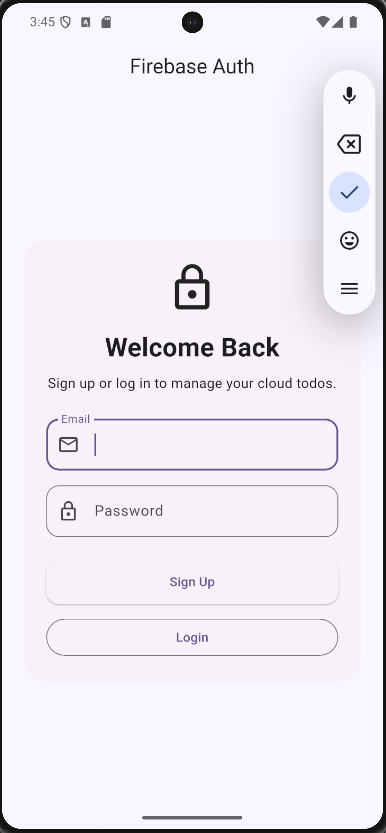
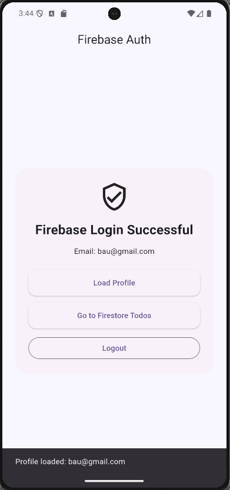
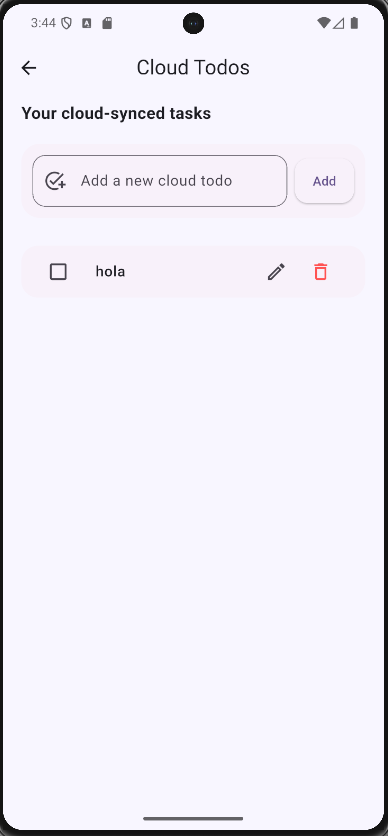

# Flutter Todo App with BLoC, API, Firebase Auth, and Firestore

This is a Flutter learning project built step by step to practice Todo app development, BLoC state management, local storage, REST API requests, repository pattern, authentication, Firebase Auth, Cloud Firestore, real-time updates, and Git/GitHub workflow.

## Project Overview

This project started as a simple local Todo app and was expanded into a full learning project.

The app includes:

- A local Todo app using SharedPreferences
- A REST API Todo screen using JSONPlaceholder
- BLoC state management
- Repository pattern
- Dependency injection basics
- Login/authentication using DummyJSON Auth API
- Token saving using SharedPreferences
- AuthWrapper routing based on saved token
- Firebase setup
- Firebase Authentication using email and password
- Firestore user profile save/read
- Firestore Todo CRUD
- Real-time Firestore todo updates using streams
- Firestore security rules
- Git branch, pull request, and merge workflow

The main goal of this project is not only to build features, but to understand how Flutter app architecture works in a real project.

## Features

### Local Todo Features

- Add new todos
- Edit existing todos
- Delete todos
- Mark todos as complete or incomplete
- Show an empty message when there are no todos
- Show SnackBar messages after actions
- Navigate between screens
- Save todos locally using SharedPreferences
- Load saved todos when the app opens
- Use BLoC for state management
- Clean folder structure

### API Todo Features

- Fetch todos from an API using GET
- Create a fake todo using POST
- Update a todo title using PATCH
- Delete a todo using DELETE
- Handle API loading, success, and error states using BLoC
- Show retry button when API loading fails
- Show button loading state while creating a todo
- Convert JSON response data into Dart model objects
- Use repository pattern between BLoC and service layer

### DummyJSON Authentication Features

- Login using username and password
- Receive access token from API
- Save token locally using SharedPreferences
- Check saved token when the app starts
- Keep user logged in after app restart
- Logout by removing saved token
- Fetch current user data using Bearer token
- Use AuthWrapper to switch between LoginScreen and ApiTodoScreen

### Firebase Authentication Features

- Firebase project setup
- Firebase initialization in Flutter
- Email/password signup
- Email/password login
- Firebase logout
- Check current Firebase user
- Show logged-in user email
- Navigate to Firestore Todo screen after login

### Firestore Features

- Create Firestore database
- Save user profile after Firebase signup
- Read user profile from Firestore
- Store each user’s todos under their own user ID
- Add Firestore todos
- Read Firestore todos
- Edit Firestore todo title
- Toggle todo complete/incomplete
- Delete Firestore todos
- Use real-time Firestore stream updates
- Use Firestore security rules so users can only access their own data

## Technologies Used

- Flutter
- Dart
- flutter_bloc
- shared_preferences
- http
- REST API
- JSONPlaceholder
- DummyJSON Auth API
- Firebase
- firebase_core
- firebase_auth
- cloud_firestore
- JSON encode/decode
- Git and GitHub

## Folder Structure

```text
lib/
 ├── blocs/
 │    ├── todo/
 │    │    ├── todo_bloc.dart
 │    │    ├── todo_event.dart
 │    │    └── todo_state.dart
 │    │
 │    ├── api_todo/
 │    │    ├── api_todo_bloc.dart
 │    │    ├── api_todo_event.dart
 │    │    └── api_todo_state.dart
 │    │
 │    ├── auth/
 │    │    ├── auth_bloc.dart
 │    │    ├── auth_event.dart
 │    │    └── auth_state.dart
 │    │
 │    ├── firebase_auth/
 │    │    ├── firebase_auth_bloc.dart
 │    │    ├── firebase_auth_event.dart
 │    │    └── firebase_auth_state.dart
 │    │
 │    └── firestore_todo/
 │         ├── firestore_todo_bloc.dart
 │         ├── firestore_todo_event.dart
 │         └── firestore_todo_state.dart
 │
 ├── models/
 │    ├── todo.dart
 │    ├── api_todo.dart
 │    └── firestore_todo.dart
 │
 ├── repositories/
 │    ├── api_todo_repository.dart
 │    ├── auth_repository.dart
 │    ├── firebase_auth_repository.dart
 │    └── firestore_todo_repository.dart
 │
 ├── services/
 │    ├── todo_api_service.dart
 │    ├── auth_service.dart
 │    ├── firebase_auth_service.dart
 │    └── firestore_service.dart
 │
 ├── screens/
 │    ├── about_screen.dart
 │    ├── add_todo_screen.dart
 │    ├── edit_todo_screen.dart
 │    ├── todo_home_page.dart
 │    ├── api_todo_screen.dart
 │    ├── login_screen.dart
 │    ├── auth_wrapper.dart
 │    ├── firebase_auth_screen.dart
 │    └── firestore_todo_screen.dart
 │
 ├── widgets/
 │    └── todo_tile.dart
 │
 ├── firebase_options.dart
 └── main.dart
```

## How the Local Todo App Works

The local Todo app uses BLoC to separate UI from logic.

Simple flow:

```text
User action
→ Event is sent
→ TodoBloc handles the event
→ New state is emitted
→ BlocBuilder rebuilds the UI
→ Updated todos are saved locally
```

Example:

```text
User adds a todo
→ AddTodoEvent is sent
→ TodoBloc adds the new todo
→ TodoLoaded(updatedTodos) is emitted
→ UI updates
→ Todos are saved in SharedPreferences
```

## Local Todo BLoC Events

The local Todo app uses these events:

```text
LoadTodosEvent
AddTodoEvent
DeleteTodoEvent
EditTodoEvent
ToggleTodoEvent
```

### LoadTodosEvent

This event runs when the app starts. It loads saved todos from local storage.

### AddTodoEvent

This event adds a new todo to the list.

### DeleteTodoEvent

This event deletes a todo using its index.

### EditTodoEvent

This event updates an existing todo title.

### ToggleTodoEvent

This event changes a todo between complete and incomplete.

## Local Todo BLoC State

The app uses a simple state:

```text
TodoLoaded
```

`TodoLoaded` contains the current todo list.

```dart
class TodoLoaded extends TodoState {
  final List<Todo> todos;

  TodoLoaded(this.todos);
}
```

This keeps the local Todo app simple and easier to understand.

## Local Storage

The app uses SharedPreferences to save todos locally.

Because SharedPreferences cannot save custom objects directly, each Todo object is converted into JSON before saving.

Save flow:

```text
Todo object
→ toJson()
→ Map
→ jsonEncode()
→ JSON String
→ SharedPreferences
```

Load flow:

```text
SharedPreferences
→ JSON String
→ jsonDecode()
→ Map
→ Todo.fromJson()
→ Todo object
```

## API Learning Feature

This project also includes an API Todo screen to practice REST API requests in Flutter.

The API feature uses JSONPlaceholder as a fake REST API for learning and testing.

### API Used

```text
https://jsonplaceholder.typicode.com/todos
```

### API CRUD Flow

```text
GET    = fetch todos from the server
POST   = create a new todo
PATCH  = update an existing todo
DELETE = delete a todo
```

### API BLoC Flow

```text
ApiTodoScreen
→ sends an event
→ ApiTodoBloc handles the event
→ ApiTodoRepository manages the data operation
→ TodoApiService makes the HTTP request
→ API response comes back
→ JSON is decoded
→ ApiTodo objects are created
→ ApiTodoBloc emits a new state
→ BlocBuilder updates the UI
```

### API States

```text
ApiTodoLoading = data is loading
ApiTodoLoaded  = data loaded successfully
ApiTodoError   = something went wrong
```

### Important API Note

JSONPlaceholder is a fake API. POST, PATCH, and DELETE requests return successful responses, but the data is not permanently saved on the server.

## Repository Pattern

This project uses the repository pattern for API and Firebase features.

Simple structure:

```text
Screen
→ Bloc
→ Repository
→ Service
→ API/Firebase
```

Meaning:

```text
Service = makes the actual API/Firebase request
Repository = manages the data layer
Bloc = handles events and states
UI = displays the state
```

This keeps the BLoC cleaner because the BLoC does not directly depend on API or Firebase service classes.

## DummyJSON Authentication Feature

This project includes a basic authentication flow using the DummyJSON Auth API.

### Auth APIs Used

```text
https://dummyjson.com/auth/login
https://dummyjson.com/auth/me
```

### Login Test Account

```text
username: emilys
password: emilyspass
```

### Auth Flow

```text
User enters username and password
→ LoginRequestedEvent is sent
→ AuthBloc calls AuthRepository
→ AuthRepository calls AuthService
→ AuthService sends POST login request
→ API returns access token
→ Token is saved in SharedPreferences
→ AuthSuccess state is emitted
→ AuthWrapper shows ApiTodoScreen
```

### Token Check Flow

```text
App starts
→ CheckAuthStatusEvent is sent
→ AuthBloc asks AuthRepository for saved token
→ If token exists, AuthSuccess is emitted
→ If token does not exist, AuthInitial is emitted
→ AuthWrapper decides which screen to show
```

### Logout Flow

```text
User taps logout
→ LogoutRequestedEvent is sent
→ AuthBloc calls AuthRepository.logout()
→ Saved token is removed from SharedPreferences
→ AuthInitial state is emitted
→ AuthWrapper shows LoginScreen
```

### Authenticated Request Flow

```text
User taps person icon
→ GetCurrentUserEvent is sent
→ Saved token is loaded
→ Token is sent in Authorization header
→ API returns current user data
→ SnackBar shows current user name
```

### Authorization Header

```text
Authorization: Bearer token
```

The token acts like a login ticket. The app sends the token to prove that the user is logged in.

## Firebase Authentication Feature

This project also includes Firebase Authentication using email and password.

### Firebase Auth Flow

```text
User enters email and password
→ FirebaseSignUpEvent or FirebaseLoginEvent is sent
→ FirebaseAuthBloc handles the event
→ FirebaseAuthRepository calls FirebaseAuthService
→ FirebaseAuthService uses FirebaseAuth
→ Firebase creates/logs in the user
→ FirebaseAuthSuccess state is emitted
→ UI shows logged-in user email
```

### Firebase Signup Flow

```text
User signs up
→ Firebase Auth account is created
→ user.uid is received
→ Firestore user profile is saved
→ FirebaseAuthSuccess is emitted
```

### Firebase Login Flow

```text
User logs in
→ FirebaseAuthService signs in the user
→ FirebaseAuthSuccess is emitted
→ UI shows the success screen
```

### Firebase Logout Flow

```text
User taps logout
→ FirebaseLogoutEvent is sent
→ FirebaseAuthService calls signOut()
→ FirebaseAuthInitial is emitted
→ UI returns to login/signup form
```

## Firestore User Profile Feature

After Firebase signup, the app saves a user profile in Firestore.

### Firestore User Structure

```text
users
 └── userId
      ├── userId
      ├── email
      └── createdAt
```

### Save Profile Flow

```text
Firebase signup successful
→ user.uid is received
→ FirestoreService.saveUserProfile() is called
→ users/userId document is created
→ email, userId, and createdAt are saved
```

### Read Profile Flow

```text
User taps Load Profile
→ FirebaseLoadUserProfileEvent is sent
→ FirebaseAuthBloc asks repository for profile
→ Repository gets current user uid
→ FirestoreService reads users/userId
→ FirebaseUserProfileLoaded state is emitted
→ SnackBar shows profile email
```

## Firestore Todo Feature

This project includes user-specific Firestore Todo CRUD.

Each logged-in Firebase user has their own todo list.

### Firestore Todo Structure

```text
users
 └── userId
      └── todos
           └── todoId
                ├── title
                ├── isDone
                └── createdAt
```

### Firestore Todo CRUD

```text
Create = add a new todo to Firestore
Read   = read todos from Firestore
Update = edit title or toggle complete/incomplete
Delete = delete a todo from Firestore
```

### Firestore Todo BLoC Flow

```text
FirestoreTodoScreen
→ FirestoreTodoEvent
→ FirestoreTodoBloc
→ FirestoreTodoRepository
→ FirestoreService
→ Firestore Database
→ FirestoreTodoState
→ UI updates
```

### Add Todo Flow

```text
User enters todo title
→ Add button is tapped
→ AddFirestoreTodoEvent(userId, title) is sent
→ FirestoreTodoBloc calls repository.addTodo()
→ FirestoreTodoRepository calls FirestoreService.addTodo()
→ Todo is saved under users/userId/todos
→ Firestore stream sends updated todo list
→ FirestoreTodoLoaded(todos) is emitted
→ UI updates
```

### Edit Todo Flow

```text
User taps edit icon
→ Edit dialog opens
→ User enters new title
→ UpdateFirestoreTodoTitleEvent is sent
→ Firestore document title is updated
→ Firestore stream sends updated todo list
→ UI updates
```

### Toggle Todo Flow

```text
User taps checkbox
→ ToggleFirestoreTodoEvent is sent
→ Firestore todo isDone field is updated
→ Firestore stream sends updated todo list
→ UI updates
```

### Delete Todo Flow

```text
User taps delete icon
→ DeleteFirestoreTodoEvent is sent
→ Firestore todo document is deleted
→ Firestore stream sends updated todo list
→ UI updates
```

## Real-Time Firestore Stream

The app uses Firestore snapshots to listen for real-time todo changes.

Old method:

```text
Change Firestore data
→ Manually call getTodos()
→ Emit loaded state
```

Real-time stream method:

```text
Change Firestore data
→ Firestore snapshots() detects change
→ FirestoreTodosUpdatedEvent is sent
→ FirestoreTodoLoaded(todos) is emitted
→ UI updates automatically
```

Simple meaning:

```text
get() = read data one time
snapshots() = listen to live data changes
```

## Firestore Security Rules

This project uses Firestore security rules so each user can only access their own data.

Basic rule idea:

```text
User must be logged in
AND
request.auth.uid must match the userId in the Firestore path
```

Example rules:

```js
rules_version = '2';

service cloud.firestore {
  match /databases/{database}/documents {

    match /users/{userId} {
      allow read, write: if request.auth != null
                         && request.auth.uid == userId;

      match /todos/{todoId} {
        allow read, write: if request.auth != null
                           && request.auth.uid == userId;
      }
    }
  }
}
```

Simple meaning:

```text
request.auth != null = user is logged in
request.auth.uid == userId = user is accessing only their own data
```

## Screens

### Todo Home Screen

The local Todo screen shows the todo list. It allows users to add, edit, delete, and complete todos.

### Add Todo Screen

This screen allows users to type a new local todo and save it.

### Edit Todo Screen

This screen allows users to update an existing local todo.

### API Todo Screen

This screen shows todos from the JSONPlaceholder API. It supports GET, POST, PATCH, and DELETE request practice.

### Login Screen

This screen allows users to log in using the DummyJSON Auth API.

### AuthWrapper

This screen decides whether to show LoginScreen or ApiTodoScreen based on the saved token.

### Firebase Auth Screen

This screen allows users to sign up, log in, log out, load profile data, and navigate to Firestore todos.

### Firestore Todo Screen

This screen allows the logged-in Firebase user to add, edit, toggle, delete, and view Firestore todos.

### About Screen

This screen gives simple information about the app.

## Git and GitHub Workflow

This project uses a professional Git workflow.

```text
main branch = stable project
api-learning branch = API CRUD feature
auth-learning branch = DummyJSON authentication feature
firebase-learning branch = Firebase Auth and Firestore feature
```

Workflow used:

```text
Create feature branch
→ Build feature
→ Commit changes
→ Push branch to GitHub
→ Open Pull Request
→ Merge into main
```

This keeps the main branch stable while new features are developed separately.

## How to Run the Project

1. Clone this repository.

```bash
git clone <repository-link>
```

2. Go into the project folder.

```bash
cd <project-folder-name>
```

3. Install packages.

```bash
flutter pub get
```

4. Start an emulator or connect a physical device.

5. Run the app.

```bash
flutter run
```

Or run on a specific emulator:

```bash
flutter run -d emulator-5554
```

## What I Learned

Through this project, I practiced:

- Flutter widgets
- Stateful screens
- Navigation using Navigator.push and Navigator.pop
- Passing data between screens
- TextEditingController
- ListView.builder
- Reusable widgets
- Local storage with SharedPreferences
- JSON encoding and decoding
- BLoC events
- BLoC states
- BlocProvider
- BlocBuilder
- BlocListener
- BlocConsumer
- API loading, success, and error states
- HTTP GET, POST, PATCH, and DELETE requests
- API service class
- Repository pattern
- Dependency injection basics
- Login API request
- Access token handling
- Saving token with SharedPreferences
- Checking auth status on app startup
- Logout flow
- Authenticated API request using Bearer token
- Firebase project setup
- Firebase initialization
- Firebase Auth signup
- Firebase Auth login
- Firebase Auth logout
- Firebase current user check
- Cloud Firestore setup
- Saving user profile to Firestore
- Reading user profile from Firestore
- Firestore subcollections
- Firestore user-specific data paths
- Firestore Todo CRUD
- Firestore real-time streams using snapshots()
- Firestore security rules
- StreamSubscription in BLoC
- Closing stream subscriptions properly
- AuthWrapper screen routing
- Git branches
- Pull requests
- Merging branches into main

## Future Improvements

- Improve UI design
- Add dark mode
- Add better loading states
- Add better error messages
- Add user profile edit screen
- Add due dates for todos
- Add priority levels
- Add categories
- Add search
- Add screenshots to README
- Add demo video
- Add app icon
- Add Firebase Storage for profile pictures
- Add more secure production Firestore rules
- Build a polished portfolio version of this app

## Screenshots

### Login Screen


### Firebase Auth Success


### Cloud Todos
